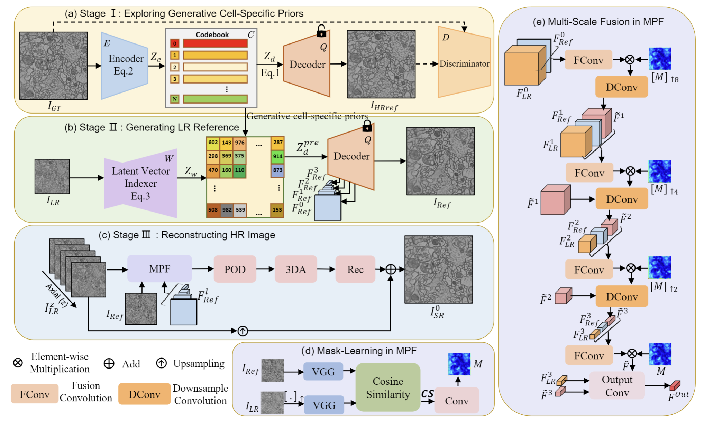
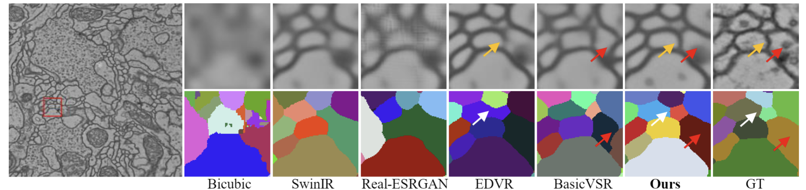
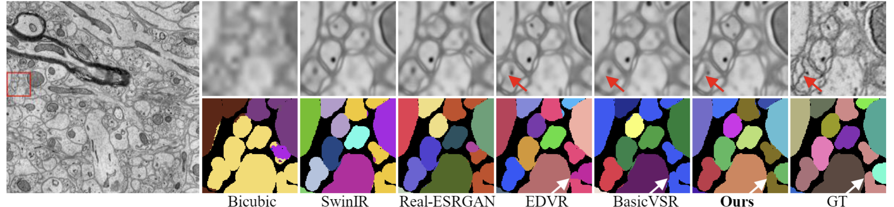

# Learning Large-Factor EM Image Super-Resolution with Generative Priors (GPEMSR)
**Accepted by CVPR-2024**  
Jiateng Shou, Zeyu Xiao, Shiyu Deng, Wei Huang, Peiyao Shi, Ruobing Zhang, Zhiwei Xiong, Feng Wu*  
MoE Key Laboratory of Brain-inspired Intelligent Perception and Cognition, University of Science and Technology of China  
Institute of Artificial Intelligence, Hefei Comprehensive National Science Center  
Suzhou Institute of Biomedical Engineering and Technology, Chinese Academy of Sciences  
*Corresponding Author



## Code instruction
We provide code for two dataset separately.  
Code for AC4 dataset is coming soon.

## Training
Three stages of our model are trained separately.  
We provide all the training code and configuration files.

## Testing
### CREMI
Please put all the trained models in the 'pre-train_model' folder.
#### Output test images
```sh
python output_GPEMSR.py -opt option/output_GPEMSR_x8.yml # for 8x EMSR  
python output_GPEMSR.py -opt option/output_GPEMSR_x16.yml # for 16x EMSR
```

#### Visual metrics
Coming soon.

#### Segmentation metrics
Please put the pre-trained segmentation models in the 'pre-train_model' folder.

|   Superhuman    | MALA |
|:---------------:|:--------:|
| [GoogleDrive](https://drive.google.com/drive/folders/1OhHJ0_Zx8VCxL2j6wsxoiXUgL_liTvxZ?usp=drive_link) | [GoogleDrive](https://drive.google.com/drive/folders/1OhHJ0_Zx8VCxL2j6wsxoiXUgL_liTvxZ?usp=drive_link) |

```sh
cd ./inference_code
python inference_seg.py -c config/seg_x8_superhuman.yaml # for 8x EMSR segmentation using superhuman model
python inference_seg.py -c config/seg_x8_MALA.yaml # for 8x EMSR segmentation using MALA model
python inference_seg.py -c config/seg_x16_superhuman.yaml # for 16x EMSR segmentation using superhuman model
python inference_seg.py -c config/seg_x16_MALA.yaml # for 16x EMSR segmentation using MALA model
```

## Pre-trained models
We provide pre-trained models for all three stages.  
We also provide pre-trained VGG model and SPyNet model.

|      CREMI      |     AC4     |
|:---------------:|:-----------:|
| [GoogleDrive](https://drive.google.com/drive/folders/1OhHJ0_Zx8VCxL2j6wsxoiXUgL_liTvxZ?usp=drive_link) | Coming Soon |

## 16x EMSR


## 8x EMSR


## Contact
If you have any problem with the released code, please contact me by email ([shoujt@mail.ustc.edu.cn](mailto:shoujt@mail.ustc.edu.cn)).
